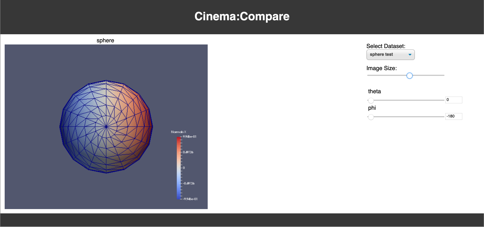
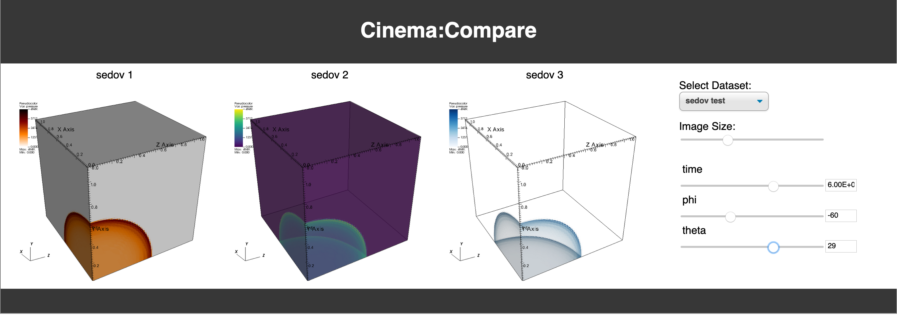

## Cinema:View repository, Release v1.1

A simple viewer that displays a single or multiple Cinema databases. These must be image-based Cinema databases following the current CSV-based specification.  Cinema:View is is easily customizable to include other elements through direct editing of the `html` or `json`.

## A Note on Browser Security
To use Cinema:View, you **MUST** allow local file access. Do this in the following way, but be sure to reset these options when you are done:

- **Firefox (preferred)**
    - type ```about:config``` in the navigaion bar
        - set ```privacy.file_unique_origin``` to **false**
        - set ```security.fileuri.strict_origin_policy``` to **false**
- **Safari**
    - Safari->Preferences->Advanced->Show Develop menu in menu bar
    - Safari->Develop->Disable Local File Restrictions (on)
- **Chrome**
    - open **chrome** with the option ```--disable-web-security```
    - Mac example:
        - ```open -na "Google Chrome" cinema_view.html --args --user-data-dir="YOUR_PATH_TO_REPO" --disable-web-security```

## Using the viewer

To use the viewer, select the database you want to see from the dropdown "Select a database". sphere test should look like:



while sedov test should look like:




## Adding a database to the viewer
Additional databases or sets of databases can be added by editing the file `cinema/view/1.1/databases.json`. This is the default location for the databases file, but you can change this as noted below.

The first entry in that file describes each of the tags needed, and the file has two examples:

1. sphere test, for a single dataset
2. sedov test for comparing 3 datasets.

To change the location of the databases.json` file:

1. directly edit the `cinema_view.html` file and change the value.
2. add an attribute on the URL when calling the viewer:

```
    file:///Users/me/data/cinema_view.html?databases=somedirectory/somename.json
```

## Contact

Contact `cinema-info@lanl.gov` for more information.
