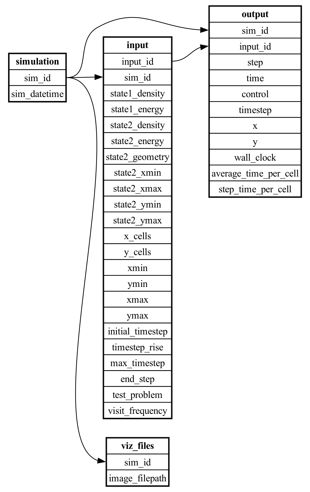

DSI Examples
============

PENNANT mini-app
----------------

`PENNANT` is an unstructured mesh physics mini-application developed at Los Alamos National Laboratory
for advanced architecture research.
It contains mesh data structures and a few
physics algorithms from radiation hydrodynamics and serves as an example of
typical memory access patterns for an HPC simulation code.

This DSI PENNANT example is used to show a common use case: create and query a set of metadata derived from an ensemble of simulation runs. 
The example GitHub directory includes 10 PENNANT runs using the PENNANT *Leblanc* test problem.

In the first step, a python script is used to parse the slurm output files and create a CSV (comma separated value) file with the output metadata.

.. code-block:: unixconfig

   python3 parse_slurm_output.py

In the second step, another python script,

.. code-block:: unixconfig

   python3 dsi_pennant.py

reads in the CSV file and creates a database:

.. literalinclude:: ../examples/pennant/dsi_pennant.py

Resulting in the output of the query:

..  figure:: images/example-pennant-output.png
    :alt: Screenshot of computer program output.
    :class: with-shadow

    The output of the PENNANT example.

Wildfire Dataset
----------------

This example highlights the use of the DSI framework with QUIC-Fire simulation data and resulting images. 
QUIC-Fire is a fire-atmosphere modeling framework for prescribed fire burn analysis. 
It is light-weight (able to run on a laptop), allowing scientists to generate ensembles of thousands of simulations in weeks. 
This QUIC-fire dataset is an ensemble of prescribed fire burns for the Wawona region of Yosemite National Park.

The original file, wildfire.csv, lists 1889 runs of a wildfire simulation. Each row is a unique run with input and output values and associated image url. 
The columns list the various parameters of interest. 
The input columns are: wild_speed, wdir (wind direction), smois (surface moisture), fuels, ignition, safe_unsafe_ignition_pattern, 
safe_unsafe_fire_behavior, does_fire_meet_objectives, and rationale_if_unsafe. 
The output of the simulation (and post-processing steps) include the burned_area and the url to the wildfire images stored on the San Diego Super Computer.

After loading dsi, run this example within the ``dsi/examples/wildfire/`` folder as all filepaths are relative to that location:

.. code-block:: unixconfig

   python3 wildfire.py

.. literalinclude:: ../examples/wildfire/wildfire.py

.. _user_schema_example_label:

Cloverleaf (Complex Schemas)
-------------------------------

This example shows how to use DSI with ensemble data from 8 Cloverleaf_Serial runs, and how to create a complex schema compatible with DSI.

The directory with this sample input and output data can be found in ``examples/clover3d/`` where each run has its own subfolder.
Each run's input file is ``clover.in`` and the output is ``clover.out`` and the associated VTK files.

After loading dsi, run this example within the ``dsi/examples/user/`` folder as all filepaths are relative to that location:

.. code-block:: unixconfig

   python3 7.schema.py

This workflow uses a custom Cloverleaf reader to load the data, along with a complex schema that maps the input data, output data, and VTK files to the respective simulation runs.
Once executing the workflow, users can see that the state2_density value is the only input parameter changed for each run.

.. literalinclude:: ../examples/user/7.schema.py

where ``examples/test/example_schema.json`` is:

.. code-block:: json

   {
      "simulation": {
         "primary_key": "sim_id"
      }, 
      "input": {
         "foreign_key": {
               "sim_id": ["simulation", "sim_id"]
         }
      }, 
      "output": {
         "foreign_key": {
               "sim_id": ["simulation", "sim_id"]
         }
      },
      "viz_files": {
         "foreign_key": {
               "sim_id": ["simulation", "sim_id"]
         }
      }
   }
   
and the generated ER diagram is:

..  figure:: images/schema_erd.png
    :scale: 35%
    :align: center

    Entity Relationship Diagram of Cloverleaf data. 
    Displays relations between the simulation, input, output, and viz_files tables.

This section explains how to define primary and foreign key relationships in a JSON file for ``schema()``, such as ``examples/test/example_schema.json``

For futher clarity, each schema file must be structured as a dictionary where:

   - Each table with a relation is a key whose value is a nested dictionary storing primary and foreign key information

      - Ex from above: "input" : { ... }
   - The nested dictionary has 2 keys: 'primary_key' and 'foreign_key' which must be spelled exactly the same to be processed:
   - The value of 'primary_key' is this table's column that is a primary key

      - Ex from above: "primary_key" : "sim_id"
   - The value of 'foreign_key' is another inner dictionary, since a table can have multiple foreign keys:

      - Each key in this dictionary is a column in this table that serves as a foreign key
      - Each value is a list with 2 elements - the table storing the associated primary key, and the column in that table which is the primary key
      - Ex: "foreign_key" : { "name" : ["table1", "table1_id"] , "age" : ["table2", "table2_id"] }
   - If a table does not have a primary or foreign key, you do not have to include them in the table's nested dictionary

For example, if we update the Cloverleaf schema by adding a new primary and foreign key relation (assuming the columns exist):

.. code-block:: json

   {
      "simulation": {
         "primary_key": "sim_id"
      }, 
      "input": {
         "primary_key": "input_id",                  // <--- new primary key
         "foreign_key": {
               "sim_id": ["simulation", "sim_id"]
         }
      }, 
      "output": {
         "foreign_key": {
               "sim_id": ["simulation", "sim_id"],
               "input_id": ["input", "input_id"]   // <--- new foreign key
         }
      },
      "viz_files": {
         "foreign_key": {
               "sim_id": ["simulation", "sim_id"]
         }
      }
   }

our new ER diagram would be:

   
    ER Diagram of same data. However, there is now an additional primary/foreign key relation from "input" to "output"