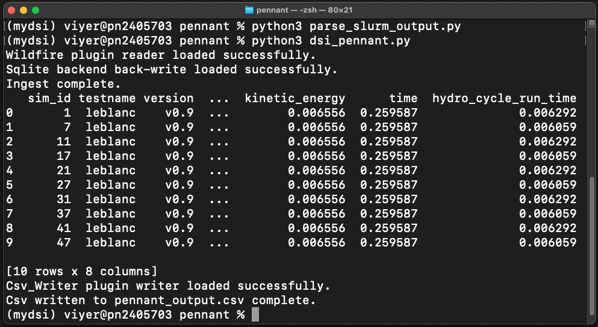
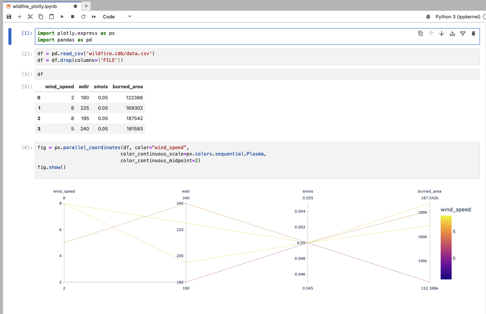
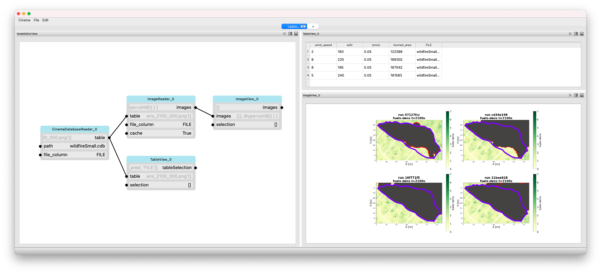

DSI Examples
============

PENNANT mini-app
----------------

`PENNANT`_ is an unstructured mesh physics mini-application developed at Los Alamos National Laboratory
for advanced architecture research.
It contains mesh data structures and a few
physics algorithms from radiation hydrodynamics and serves as an example of
typical memory access patterns for an HPC simulation code.

This DSI PENNANT example is used to show a common use case: create and query a set of metadata derived from an ensemble of simulation runs. 
The example GitHub directory includes 10 PENNANT runs using the PENNANT *Leblanc* test problem.

In the first step, a python script is used to parse the slurm output files and create a CSV (comma separated value) file with the output metadata.

.. code-block:: unixconfig

   python3 parse_slurm_output.py

In the second step, another python script,

.. code-block:: unixconfig

   python3 dsi_pennant.py

reads in the CSV file and creates a database:

.. literalinclude:: ../examples/pennant/dsi_pennant.py

Resulting in the output of the query:

    The output of the PENNANT example.

Wildfire Dataset
----------------

This example highlights the use of the DSI framework with QUIC-Fire simulation data and resulting images. 
QUIC-Fire is a fire-atmosphere modeling framework for prescribed fire burn analysis. 
It is light-weight (able to run on a laptop), allowing scientists to generate ensembles of thousands of simulations in weeks. 
This QUIC-fire dataset is an ensemble of prescribed fire burns for the Wawona region of Yosemite National Park.

The original file, wildfire.csv, lists 1889 runs of a wildfire simulation. Each row is a unique run with input and output values and associated image url. 
The columns list the various parameters of interest. 
The input columns are: wild_speed, wdir (wind direction), smois (surface moisture), fuels, ignition, safe_unsafe_ignition_pattern, 
safe_unsafe_fire_behavior, does_fire_meet_objectives, and rationale_if_unsafe. 
The output of the simulation (and post-processing steps) include the burned_area and the url to the wildfire images stored on the San Diego Super Computer.

All paths in this example are defined from the main dsi repository folder, assumed to be ``~/<path-to-dsi-directory>/dsi``.

To run this example, load dsi and run:

.. code-block:: unixconfig

   python3 examples/wildfire/wildfire.py

.. literalinclude:: ../examples/wildfire/wildfire.py

This will generate a wildfire.cdb folder with downloaded images from the server and a data.csv file of numerical properties of interest. 
This cdb folder is called a `Cinema`_ database (CDB). 
Cinema is an ecosystem for management and analysis of high dimensional data artifacts that promotes flexible and interactive data exploration and analysis.  
A Cinema database is comprised of a CSV file where each row of the table is a data element (ex: run or ensemble member of a simulation) and each column is a property of the data element. 
Any column name that starts with 'FILE' is a path to a file associated with the data element.  
This could be an image, a plot, a simulation mesh or other data artifact.

Cinema databases can be visualized through various tools. We illustrate two options below:

To visualize the results using Jupyter Lab and Plotly, run:

.. code-block:: unixconfig

   python3 -m pip install plotly
   python3 -m pip install jupyterlab

Open Jupyter Lab with:

.. code-block:: unixconfig

  jupyter lab --browser Firefox

and navigate to ``wildfire_plotly.ipynb``.  Run the cells to visualize the results of the DSI pipeline.

    Screenshot of the JupyterLab workflow. 
    The CSV file is loaded and used to generate a parallel coordinates plot showing the parameters of interest from the simulation.

Another option is to use `Pycinema`_, a QT-based GUI that supports visualization and analysis of Cinema databases. 
To open a pycinema viewer, first install pycinema and then run the example script.

.. code-block:: unixconfig

   python3 -m pip install pycinema
   cinema examples/wildfire/wildfire_pycinema.py

    Screenshot of the Pycinema user interface showing the minimal set of components. 
    Left: the nodeview showing the various pycinema components in the visualization pipeline; 
    upper-right: the table-view; 
    lower-right: the image view. 
    Pycinema components are linked such that making a selection in one view will propagate to the other views.

.. _PENNANT: https://github.com/lanl/PENNANT
.. _Cinema: https://github.com/cinemascience
.. _PyCinema: https://github.com/cinemascience/pycinema