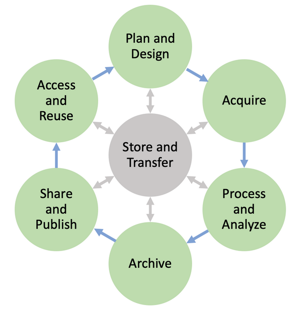
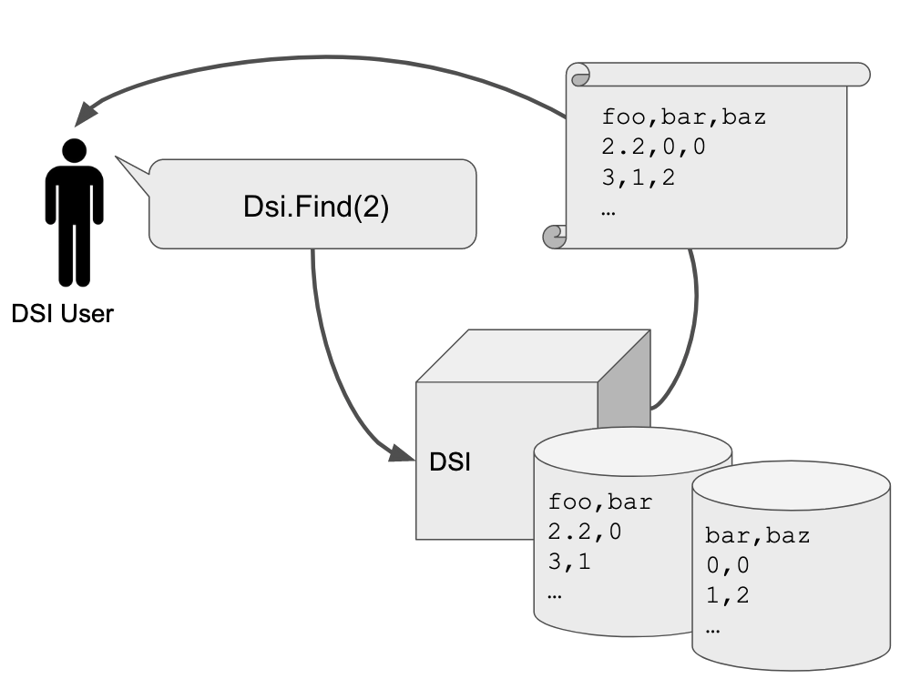

Introduction
============

The goal of the Data Science Infrastructure Project (DSI) is to manage data through metadata capture and curation.  
DSI capabilities can be used to develop workflows to support management of simulation data, AI/ML approaches, ensemble data, and other sources of data typically found in scientific computing. 

DSI infrastructure is designed to be flexible and with these considerations in mind:
    - Data management is subject to strict, POSIX-enforced, file security.
    - DSI capabilities support a wide range of common metadata queries.
    - DSI interfaces with multiple database technologies and archival storage options.
    - Query-driven data movement is supported and is transparent to the user.
    - The DSI API can be used to develop user-specific workflows.

    A depiction of data life cycle can be seen here. The DSI API supports the user to manage the life cycle aspects of their data.

DSI system design has been driven by specific use cases, both AI/ML and more generic usage.  
These use cases can often be generalized to user stories and needs that can be addressed by specific features, e.g., flexible, human-readable query capabilities. 

Implementation Overview
-----------------------

The DSI API is broken into three main categories:

- Readers/Writers: frontend capabilities that DSI users will use to import/export data.
- Backends: objects that are used to interact with storage devices and other ways of moving data. 
- DSI Core: the *middleware* that contains the basic functionality to use the DSI API. 
  This connects Readers/Writers to Backends through several modules exposed to users.

Expected Data Standards
~~~~~~~~~~~~~~~~~~~~~~~~

Before using DSI, users are expected to preprocess their data into a standardized format.
DSI's actions are strict and will not commit any database actions if the data is unstable.

This can be achieved by organizing the data so it can be represented as a table in DSI. 
It is also expected that each data point is a discrete value, rather than a complex data structure.
If metadata is crucial to data representation, users should ensure it is stored with the data to be captured by DSI actions.

Users expecting to load a complex schema into DSI should also consider which columns in tables will be related to each other.
This requires prior knowledge of primary and foreign keys, and writing a JSON file to represent this schema. 
For a template DSI-compatible schema, review ``examples/data/example_schema.json``

.. For more information on a schema compatible with DSI, please view :ref:`user_schema_example_label`.

DSI Readers/Writers
~~~~~~~~~~~~~~~~~~~~

Readers/Writers transform an arbitrary data source into a format that is compatible with the DSI core. 
The parsed and queryable attributes of the data are called *metadata* -- data about the data. 
Metadata shares the same security profile as the source data.

Data Readers parse an input file of its metadata and data and stores it within DSI memory.
Data Writers convert metadata and data stored in DSI to an output file - ex: an image or a CSV

Currently, DSI has the following Readers:
  - CSV
  - JSON
  - Schema (A complex schema reader)
  - YAML1
  - TOML1
  - Bueno
  - Ensemble (Reader to ingest ensemble data. Ex: the `Wildfire ensemble dataset <https://github.com/lanl/dsi/tree/main/examples/wildfire>`_ . 
    Assumes each data row is a separate sim.)
  - Oceans11Datacard (Data card for datasets on the `Oceans11 LANL data server <https://oceans11.lanl.gov>`_)
  - DublinCoreDatacard (Data card that adheres to the `Dublin Core metadata standard <https://www.dublincore.org/resources/metadata-basics/>`_ ) 
  - SchemaOrgDatacard (Data card that adheres to the `Schema.org metadata standard <https://schema.org/Dataset>`_ )
  - GoogleDatacard (Data card that adheres to the `Google Data Cards Playbook <https://sites.research.google/datacardsplaybook/>`_ )

Currently, DSI has the following Writers:
  - Csv_Writer
  - ER_Diagram
  - Table_Plot

DSI Backends
~~~~~~~~~~~~~

Backends are an interface between the DSI Core and a storage medium.
Backends are designed to support a user-needed functionality.
The default backend used in DSI is **SQLite**, but there are an options to use others such as DuckDB as well.

Users can interact with a backend by ingesting data into one from DSI, querying its data through abstracted find functions, or processing its data into DSI.
Users can also find instances of an object in a backend, display a table's data, or view statistics of each table in a backend.

   In this example **user story**, the user has metadata about their data stored in DSI storage of some type.  
   The user needs to extract all instances of the variable **foo**. 
   DSI backends find data from the DSI metadata to locate and return all such information.

Current DSI backends include:

- SQLite: Python based SQL database and backend; the **default** DSI API backend.
- DuckDB: In-process SQL database designed for fast queries on large data files

DSI Core
~~~~~~~~

DSI basic functionality is contained within the middleware known as the *core*.
Users will leverage Core to employ Readers, Writers, and Backends to interact with their data.
The two primary methods to achieve this are with the :ref:`python_api_label` or the :ref:`cli_api_label`