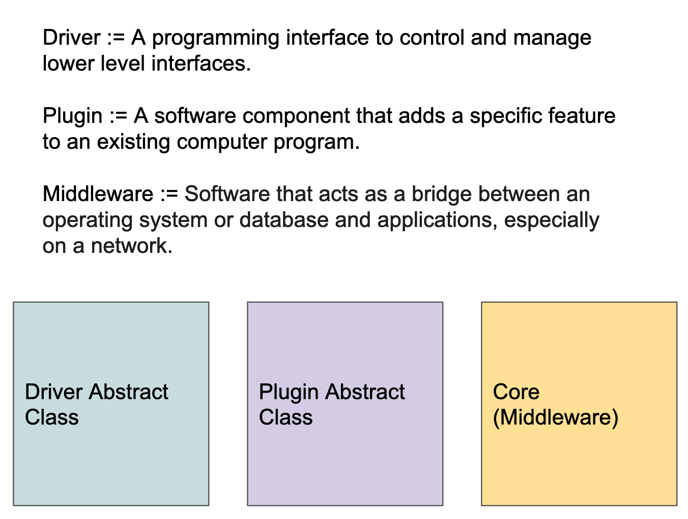

============
Introduction
============

The goal of the Data Science Infrastructure Project (DSI) is to manage data through metadata capture and curation.  DSI  capabilities can be used to develop workflows to support management of simulation data, AI/ML approaches, ensemble data, and other sources of data typically found in scientific computing.  DSI infrastructure is designed to be flexible and with these considerations in mind:

- Data management is subject to strict, POSIX-enforced, file security.
- DSI capabilities support a wide range of common metadata queries.
- DSI interfaces with multiple database technologies and archival storage options.
- Query-driven data movement is supported and is transparent to the user.
- The DSI API can be used to develop user-specific workflows.

..  figure:: data_lifecycle.png
    :alt: Figure depicting the data life cycle
    :class: with-shadow
    :scale: 50%

    A depiction of data life cycle can be seen here. The Data Science Infrastructure API supports the user to manage the life cycle aspects of their data.

DSI system design has been driven by specific use cases, both AI/ML and more generic usage.  These use cases can often be generalized to user stories and needs that can be addressed by specific features, e.g., flexible, human-readable query capabilities.  DSI uses Object Oriented design principles to encourage modularity and to support contributions by the user community.  The DSI API is Python-based.

Implementation
==============
The DSI system is composed of three fundamental parts:

DSI Core Middleware
-------------------
DSI's core middleware is focused on delivering user-queries on unified metadata which are distributed across many files and security domains. DSI currently supports Linux, and is tested on RedHat- and Debian-based distributions. The DSI Core middleware is a home for DSI Plugins and an interface for DSI Backends.

Plugin Abstract Classes
-----------------------
Plugins transform an arbitrary data source into a format that is compatible with our middleware. We call the parsed and queriable attributes "metadata" (data about the data). Metadata share the same security profile as the source data.

Plugins can operate as data readers or data writers. A simple data reader might parse an application's output file and place it into a middleware compatible data structure: Python built-ins and members of the popular Python ``collection`` module. A simple data writer might execute an application to supplement existing data and queriable metadata.

Plugins are defined by a base abstract class, and support child abstract classes which inherit the properties of their ancestors.

.. image:: PluginClassHierarchy.png

Backend Abstract Classes
------------------------
Backends are an interface between the User and the Core, or an interface between the Core and a storage medium. Backends can operate as Front-ends or Back-ends, and a Backend contributor can choose to implement one or both. Backend front-ends are built to deliver an experience which is compatible with a User Story. A simple supporting User Story is a need to query metadata by SQL query. Because the set of queriable metadata are spread across filesystems and security domains, a supporting Backend Back-end is required to assemble query results and present them to the DSI core middleware for transformation and return, creating an experience which is compatible with the User Story.

.. image:: user_story.png
   :scale: 50%
