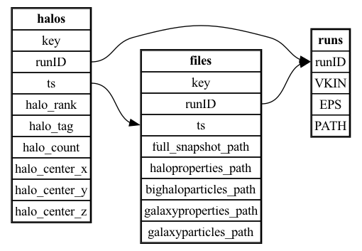

# HACC Ensemble Simulations DSI Plugin

This folder contains a DSI plugin for HACC ensemble simulations.  

- **`add_plugin.py`**: The main script to run, which adds the HACC reader to DSI. It also supports other DSI functionalities, such as using a backend to save an SQL-based metadata database and executing queries.  
- **`hacc.json`**: Defines the foreign key relationships between tables.  
- **`hacc_reader.py`**: The main implementation of the plugin.  

## Requirements  

Ensure the following dependencies are installed before running the plugin:  

- **DSI**: Install DSI following the instructions [here](https://github.com/lanl/dsi).  
- **GenericIO**: Install GenericIO by following the instructions [here](https://git.cels.anl.gov/hacc/genericio).  
- Update your GenericIO **legacy_python** path in [`hacc_reader.py`](https://github.com/lanl/dsi/blob/55e96e2b68824353e68e5bb2dff9713147c7d303/examples/hacc/hacc_reader.py#L6).  

## Running the Plugin and Creating the Metadata Database  

To use the HACC reader, provide the following input arguments:

```python
term.load_module(
    'plugin', 'HACC', 'reader',
    filename="./hacc.json",
    hacc_suite_path="/lus/eagle/projects/CosDiscover/nfrontiere/SCIDAC_RUNS/128MPC_RUNS_FLAMINGO_DESIGN_3A/",
    hacc_run_prefix='FSN',
    target_table_prefix='hacc'
)
```

### Argument Descriptions  

- **`filename`**: JSON file defining the foreign key setup.  
- **`hacc_suite_path`**: Path to your HACC ensemble simulations.  
- **`hacc_run_prefix`**: Prefix for ensemble run folders, used to read all runs from `hacc_suite_path`.  

### Run the Plugin  

Execute the following command to run the plugin:  

```bash
python3 add_plugin.py
```

### Current Database Schema 



